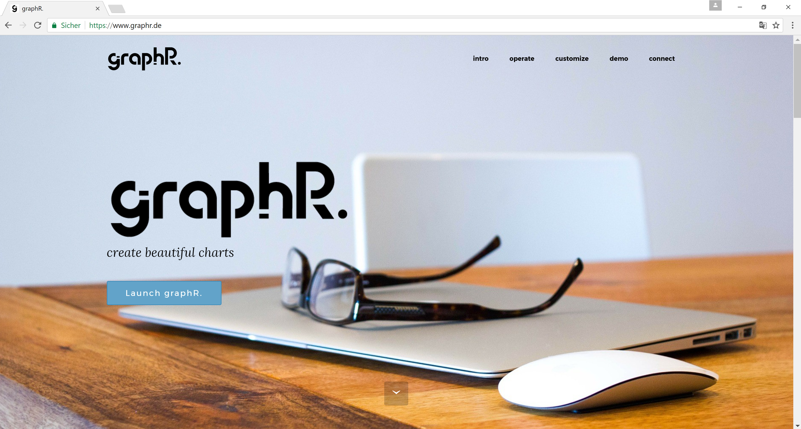

# graphR.
<a href="https://www.graphr.de"></a> 
The purpose of **graphR.** is to automatize and simplify the analysis of RVTools exports and to give a visual presentation of the information contained within one Excel export. [RVTools](http://www.robware.net/rvtools/) is a VMware utility that connects to a vCenter and gathers information with an impressive level of detail on the VMware environment (e. g. on virtual machines, on ESX hosts, on the network configuration). The data collection is fast and easy. The end result can be stored in a Microsoft Excel file. RVTools exports are a great way to collect data on VMware environments. However, analyzing RVTool exports especially of complex environments can be time-consuming, error-prone and cumbersome.  
That's where **graphR.** steps in. **GraphR.** processes RVTool exports which are saved as Microsoft Excel or as comma seperated files. It performs some statistical analysis on the data contained within the Microsoft Excel file. The dataset is visualized through some beautiful looking diagrams. Finally all tables and charts are assembled in one downloadable PDF report. Hence **graphR.** enables you to generate a concise report with some great graphics
in order to derive meaningful insights on the analyzed VMware environment.  

 If you are interested, find out more at the [graphR. website](https://www.graphr.de). There you can also try the [app](https://www.launch.graphr.de) online and get started right away.
___

## Table of Contents
    
* [Prerequisites](https://github.com/smichard/graphR#prerequisites)
* [Getting Started](https://github.com/smichard/graphR#getting-started)
* [Customize](https://github.com/smichard/graphR#customize)
* [How to use graphR.](https://github.com/smichard/graphR#how-to-use-graphr)
* [Built With](https://github.com/smichard/graphR#built-with)
* [Author](https://github.com/smichard/graphR#author)
* [Support](https://github.com/smichard/graphR#support)
___

## Prerequisites

To run **graphR.** you just need an eviroment which supports Docker containers. To customize **graphR.** according to your needs the installation of the open source programming language [R](https://www.r-project.org/) is recommended.

## Getting Started

The easiest way to use **graphR.** is to pull the latest pre-build Docker container from [Dockerhub](https://hub.docker.com/r/smichard/graphr/) and to run it within your enviroment. The following commands will download **graphR.** from Dockerhub and make it available on your enviroment using it's ip-address

```
docker pull smichard/graphr
docker run -d -p 80:3838 smichard/graphr
```

## Customize

To customize **graphR.** according to your needs, e. g. by adding new ways to plot the data, altering threshold values or adding a custom design just clone this repository:

```
git clone https://github.com/smichard/graphR.git
```
Since the core of **graphR.** is written in R the installation of R is recommended to see the chances taking effect. If you are using R-Studio as code editor the `graphr_dashboard.Rproj` file contains all necessary files to adjust **graphR.**    

Following a short description of the most important files:  

* `app.R` - the main file, which is needed by the Shiny web framework to display the web app. Here the GUI of the web app is described, also sources the `libraries.R` and the `server_rv.R` files 
* `server_rv.R` - contains all necessary functions to ingest the raw data, to perform some basic analysis, to generate diagrams and to finally generate the pdf report
* `plottingFunctions.R` - a set of functions to display text, data frames and diagrams on slides
* `libraries.R` - contains a list of all required R packages, also sources the `plottingFunctions.R` file

In case you want to use custom backgrounds according to your corporate identity just replace the image files within the `/graphr/backgrounds` folder and make sure to use the `.png` file format. The recommended image dimensions are 960 px times 540 px.

Once all changes are done you can build your own custom **graphR.** container using the following commands: 
```
docker build -t <project name> .
docker run -d -p 80:3838 <project name>
```

## How to use graphR.

The use of graphR. is designed to be simple: 

1. Collect the data with the [RVTools](http://www.robware.net/rvtools/) and save the export as `.xls`, `.xlsx` or as `.csv` file
2. Upload the `.xls` / `.xlsx` file (recommended) or the `tabvInfo.csv` to graphR. and hit `Generate Report`
3. Enjoy your report

get a glimpse through this YouTube video:

<a href="https://youtu.be/dotbSX79FJg"></a> 

## Built With

* [R](https://www.r-project.org/) - The open source programming language for statistical computing
* [R-Studio](https://www.rstudio.com/) - Used as code editor for R and for debugging and visualization
* [Shiny](https://shiny.rstudio.com/) - Used as web application framework for R
* [Docker](https://www.docker.com/) - Used to package all dependencies into one container

## Author

* **Stephan Michard** - reach out on [Twitter](https://twitter.com/StephanMichard)

## Support

Please file bugs and issues at the GitHub issues page. The code and documentation are released with no warranties or SLAs and are intended to be supported through a community driven process.

